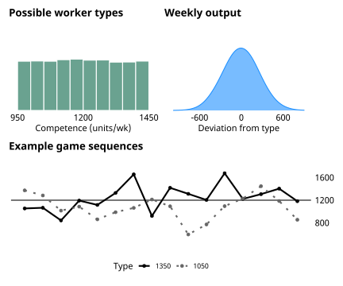
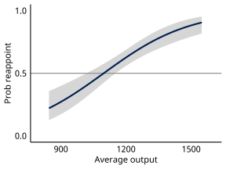
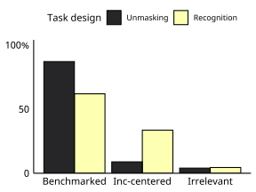

```{r setup, include=FALSE}
  options(htmltools.dir.version = FALSE)
  knitr::opts_chunk$set(
    message=F, 
    warning=F, 
    eval=T, 
    echo=F, 
    fig.align='center', 
    dev='svglite', 
    dpi = 400
  )
  
  library(tidyverse)
  library(knitr)
```

# Quality Control (2023, Cambridge) 
  

.pull-left-1[
&nbsp;

.center[]

]

.pull-right2[
&nbsp;

|   | Austin Hart | American <br> University|
|:-------------------------:|:-------------------------:|:---------------:|
|   |  Scott Matthews | Memorial <br> University|


]

---
# Retrospective voting

.left-column[

### Foundational

]

.right-column[

  
> Citizens hold governments accountable for their performance in office.
> They reward good outcomes and sanction poor outcomes.  
> *Downs (1957), Fiorina (1981)*


- Requires voters to...
  - integrate and appraise performance info  
  - Apply their judgment to vote choice   
- Ex: good economy and incumbent electoral success 

]

---
# Retrospective voting

.left-column[

### Foundational

### Ubiquitous-ish

]

.right-column[

```{r, echo=FALSE, out.width="80%"}

```
]


---
# Retrospective voting

.left-column[

### Foundational

### Ubiquitous-ish

### Causal

]

.right-column[
- $\Delta RetroEval_{i} \rightarrow \Delta Pr(Vote_{i} = Inc)$
  - Hart (2013, **2016**)   
  - Hart & Middleton (2015)    
  - Lenz (2012)
  
.center[]

]


---
# Retrospective voting

.left-column[

### Foundational

### Ubiquitous-ish

### Causal

### Meaningless?
]

.right-column[

- Evidence consistent with pessimistic alternative  
- Blind retrospection 
  - Judgment is myopic, emotional  
  - Cannot identify incumbent effort  
  - Performance voting = kicking the dog (Achen & Bartels 2016)

]


---
# Unexplored microfoundations

### Can subjects differentiate competent from incompetent incumbents?  


- Retrospective voting *requires*
  - **Integration** over stream of performance info
  - **Appraisal** of impression
  
- But I/A largely unseen
  - Uncommon focus of theory
  - Obs & Exp limitations


---
# Contributions of the book
  
  
.pull-left[
### Integration/Appraisal framework
- Theoretical & empirical lens for studying retrospective voting
- 11 experiments allowing I/A to unfold
  - Competency/biases
  - Confronting spillover
  - Seeking and using performance cues 
]

.pull-right[
### Case for 'synthetic' experiments
- Rethinking realism and external validity
- Impact\-estimating vs Theory\-testing
- Criteria for external validity for experiments that test theory
]


---
class: segue-yellow

# Capacity and bias in I/A


---
# Experimental framework

.pull-left-1[

- Monitor new worker
- Vote to reappoint/replace
- Bonus $\propto$ factory output
- Worker is fully\-trained but 
  - Type unknown, <br> $\mu_{inc} \sim U(950,1450)$
  - Output variable, <br> $Y_{inc,t} \sim N(\mu_{inc},250^2)$  
  


]

.pull-right2[
&nbsp; 
.center[]
]

---
# Exp 1. Baseline performance vote

### Given variable stream, can subjects identify competence? 

.pull-left-1[
- N = 248

- Key design elements
  - $\mu_{inc} \sim U(950,1450)$
  - Output $Y_{inc,t} \sim N(\mu_{inc},250^2)$

- Findings
  - Subjects manage I/A
  - Demonstrate rules comp
  - Not 'blindly retro'
]

.pull-right-2[

```{r fig3, out.width = '550px'}
  
```
]

---
# Exp 4. Recency bias

### Do participants overemphasize recent/late-term performance? 

.pull-left-1[
- N = 764

- Key design elements
  - Fixed output
  - Randomize timing of "drop"
  
- Findings
  - Recency bias in I/A
  - Not 'highly sophisticated'
]

.pull-right-2[

```{r fig6, out.width = '550px'}
  knitr::include_graphics('figures/study4sum.svg')
```
]


---
class: segue-yellow

# Confronting spillover in I/A


---
# Multiworker designs
### Can voters differentiate competence from luck? 

.pull-left-1[
### Game Flow
1. Comparator begins
2. Monitor factory output, $F_{pre}$
3. Incumbent arrives in week 9
4. Monitor factory output, $F_{post}$
5. Vote on reappointment
]

.pull-right-2[
```{r multiflow, out.width = '550px'}
  knitr::include_graphics('figures/multidesign.svg')
```
]


---
# Exp 5. Unmasking competence

### Can subjects extract competencce from confounded stream? How?

.pull-left-1[
- N = 819  

- Key design elements
  - Randomize type\output
  - Variance treatment $\sigma_{comp} \in (100,250)$
  
- Findings
  - Capable signal extraction
  - Benchmark processing
]

.pull-right-2[
```{r study5, out.width = '550px'}
  knitr::include_graphics('figures/study5sum.svg')
```
]


---
# Exp 8. Seeking performance cues

### Do participants actively seek pre-benchmarked information? 

.pull-left-1[
- N = 720

- Key design elements
  - Two\-worker stream
  - Randomize game type
  - Offer choice of two reports
  
- Findings
  - Benchmark seeking
  - Esp in difficult task
]

.pull-right-2[
```{r fig8, out.width = '550px'}
  
```
]

---
# Overview of experimental results

- I/A over variable streams
  - Capable judges of competence
  - Clear strategy to confront spillover

- Clear limitations
  - Sub-optimal decisions
  - Recency bias; maybe some negativity bias

- Strategic, if sub-optimal, behavior
  - Quick to benchmark
  - Quick to seek out benchmarks


---
class: segue-yellow

# External validity and experimental design


---
# Synthetic experiments and generalization

&nbsp;

> If we want to learn about political behavior, shouldn't our design be more *realistic*?

&nbsp;

.center[.large[No.]]


---
# Rethinking realism and generalization

&nbsp;
<blockquote>
Whereas [randomized evaluations] generally have high mundane
realism, some—but not all!—laboratory and survey experiments do not and thus provide a poor basis for external validity inferences
.right[-- Findley et al. (2021)]
</blockquote>


- Realism/parallelism of experiment...
  - cannot establish external validity
  - may limit, rather than strictly enhance, external validity
  
- Study should mimic the target of generalization

---
# Intent and design

&nbsp;

|                       | Impact-estimating | Theory-testing    |
|:----------------------|:------------------|:------------------|
| Generalize to what?   | Impact/ATE        | Model             |
| Nature of target      | Complex           | Minimalistic      |
|                       | Context-bound     | "Universal"       |
| Design to match       | Realistic         | Synthetic         | 
|                       | Specific          | Abstract          |
| Limitations           | Local             | Thin              |


---
# Criteria for external validity

### in 'synthetic' experiments for testing theory

- Setup
  - Identify theory testing as central goal
  - Ground generalization in theory
  - Specify models & *a priori* propositions under study  

- Design
  - Exp "world" captures only essential essence of the models
  - Creates space for contested behaviors to emerge
  - Experimental realism


---
class: sydney-red

# *Quality Control* and beyond

- Integration-appraisal framework
  - I/A *necessary* for RV
  - Allowed to unfold in controlled settings
  
- Findings from 11 experimental tests
  - Capacity beyond blind retrospection
  - Strategic, imperfect benchmarking 

- Next steps  
  - Appraise first, integrate later
  - Locating negativity bias
